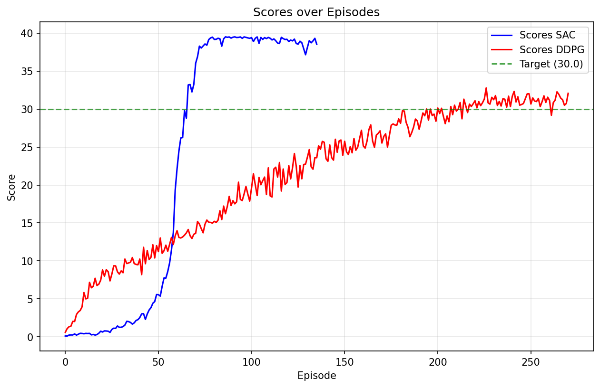

# Reacher Continuous Control Project Report

## Project Overview

This project implements and compares two actor-critic reinforcement learning algorithms for training 20 robotic arm agents to reach target locations in a Unity ML-Agents environment. The agents learn to control double-jointed arms to maintain their hands in target locations, receiving rewards for successful positioning.

**Environment Details:**
- **State Space**: 33-dimensional continuous vector (position, rotation, velocity, and angular velocities)
- **Action Space**: 4-dimensional continuous actions (torque for two joints, each between -1 and 1)
- **Agents**: 20 identical agents training in parallel
- **Goal**: Achieve an average score of +30 over 100 consecutive episodes (averaged over all 20 agents)

## Learning Algorithms

### 1. DDPG (Deep Deterministic Policy Gradient) Agent

The DDPG implementation follows the actor-critic paradigm with deterministic policy gradients for continuous control:

**Core Algorithm Features:**
- **Actor-Critic Architecture**: Separate networks for policy (actor) and value function (critic)
- **Experience Replay**: Large replay buffer to break correlation between consecutive samples
- **Target Networks**: Separate target networks for both actor and critic with soft updates
- **Ornstein-Uhlenbeck Noise**: Temporally correlated noise for exploration in continuous action space

**Hyperparameters:**
```python
BUFFER_SIZE = 1,000,000  # replay buffer size
BATCH_SIZE = 256         # minibatch size
GAMMA = 0.99             # discount factor
TAU = 5e-3               # soft update parameter for target networks
LR_ACTOR = 3e-4          # actor learning rate
LR_CRITIC = 3e-4         # critic learning rate
WEIGHT_DECAY = 0         # L2 weight decay

# Ornstein-Uhlenbeck Noise parameters
mu = 0.0                 # mean
theta = 0.15             # mean reversion rate
sigma = 0.1              # volatility parameter
```

**Neural Network Architecture:**

**Actor Network:**
- **Input Layer**: 33 neurons (state size)
- **Hidden Layer 1**: 400 neurons with ReLU activation
- **Hidden Layer 2**: 300 neurons with ReLU activation
- **Output Layer**: 4 neurons (action size) with tanh activation (outputs in [-1,1])

**Critic Network:**
- **Input Layer**: 33 neurons (state size)
- **Hidden Layer 1**: 400 neurons with ReLU activation
- **Action Injection**: Actions concatenated after first hidden layer
- **Hidden Layer 2**: 300 neurons with ReLU activation
- **Output Layer**: 1 neuron (Q-value)

### 2. SAC (Soft Actor-Critic) Agent

> **AI Assistance Disclaimer**: The SAC (Soft Actor-Critic) implementation in this project was developed with assistance from AI tools.

The SAC implementation uses maximum entropy reinforcement learning with automatic temperature tuning:

**Core Algorithm Features:**
- **Maximum Entropy Framework**: Encourages exploration through entropy regularization
- **Twin Critic Networks**: Two Q-networks to reduce overestimation bias (clipped double Q-learning)
- **Stochastic Policy**: Gaussian policy with reparameterization trick for gradient flow
- **Automatic Temperature Tuning**: Learns optimal exploration-exploitation balance automatically
- **Experience Replay**: Large replay buffer for off-policy learning

**Hyperparameters:**
```python
BUFFER_SIZE = 1,000,000  # replay buffer size
BATCH_SIZE = 256         # minibatch size
GAMMA = 0.99             # discount factor
TAU = 5e-3               # soft update parameter for target networks
LR_ACTOR = 3e-4          # actor learning rate
LR_CRITIC = 3e-4         # critic learning rate
LR_ALPHA = 3e-4          # temperature parameter learning rate
```

**Neural Network Architecture:**

**Actor Network:**
- **Input Layer**: 33 neurons (state size)
- **Hidden Layer 1**: 256 neurons with ReLU activation
- **Hidden Layer 2**: 256 neurons with ReLU activation
- **Mean Output**: 4 neurons (action means)
- **Log Std Output**: 4 neurons (action log standard deviations)
- **Action Sampling**: Reparameterization trick with tanh squashing

**Twin Critic Networks:**
- **Input Layer**: 33 neurons (state size) + 4 neurons (action size) = 37 total
- **Hidden Layer 1**: 256 neurons with ReLU activation
- **Hidden Layer 2**: 256 neurons with ReLU activation
- **Output Layer**: 1 neuron (Q-value)

## Results and Performance

### Training Performance

Both agents successfully solved the environment, achieving the target average score of +30 over 100 consecutive episodes:

|  | DDPG | SAC |
|--------|------|-----|
| Episodes to solve | ~270 | ~140 |
| Training stability | Requires tuning | Very stable |
| Convergence speed | Slower | Faster |

### Plot of Rewards



Direct comparison of both agents shows SAC's superior sample efficiency and stability compared to DDPG. Notably, the SAC agent consistently achieved peak average rewards close to 40, while DDPG often plateaued around 30, suggesting it may get stuck in a local optimum. SAC required minimal hyperparameter tuning and performed robustly across different runs, whereas DDPG needed several training runs and careful adjustment of parameters to achieve satisfactory performance.

## Future Work

- **Hyperparameter Optimization for DDPG:** Investigate why DDPG plateaus around score 30 and optimize hyperparameters to break through this limitation

- **TD3 (Twin Delayed DDPG) Implementation:** Implementing TD3 (Fujimoto et al. 2018), which addresses three key problems of DDPG: Double Critics, Target Policy Smoothing and Delayed Policy Updates
